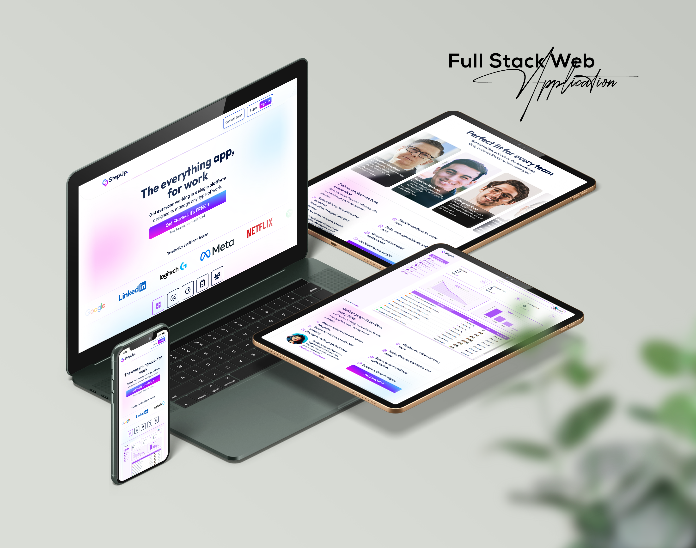

<h3>Project: StepUp – Project Progress Management Web Application</h3>

<b>Used Language/Library/Frameworks/Tools (Full Stack):</b> HTML5, CSS3, Tailwind CSS, React, React Router, Zustand, Axios, Node Js, Express Js, MongoDB, Mongoose, Vercel, Github, Git

A full-stack, team-oriented project management web application inspired by Jira/ClickUp, designed to streamline task progress tracking, role-based access, and team collaboration.
  

<h4>Features:</h4>

Developed a task management platform for teams with features like task creation, date tracking, and status updates.

<ul type="square" style="display:flex; gap:5px; margin-bottom:10px;">
  <li>Ready Responsive Website UI/UX Design Using Figma.</li>
  <li>Designed and developed a fully responsive MERN-based platform with Firebase Authentication and RESTful APIs following the MVC architecture.</li>
  <li>Implemented task lifecycle management (To-Do, In Progress, Completed), role-based dashboards, team invitations, and real-time status updates.</li>
  <li>Integrated an admin panel with dynamic charts for monitoring team activity, task flow, and project timelines.</li>
  
</ul>

<b>Additional:</b> Admin panel for team/task monitoring.

<b>StepUp Project Progress Web Application Live Link: </b><a href="https://stepup-3fe41.web.app/">Click Here</a> 
 

